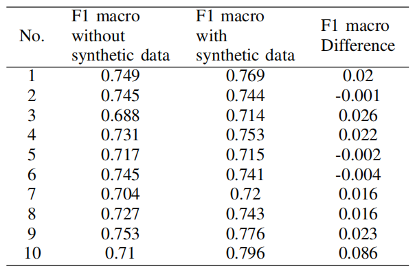

# Synthetic Time Series Classification

This project focuses on generating synthetic eye movement data using Time Series Generative Adversarial Networks (TSGAN) and enhancing the performance of a 1D CNN-BLSTM model through data augmentation.

Thesis link: [Thesis PDF](https://drive.google.com/file/d/1g4GeShLb0g26zf6gx_8s9kw6mNs_QT5Y/view?usp=sharing)

## Modifications and Additions

- Implemented TSGAN for synthetic eye movement data generation.
- Created pseudo-labels for synthetic data to improve model training.
- Enhanced the 1D CNN-BLSTM model to achieve higher macro F1 scores.
- Implemented 1D Fréchet Inception Distance (FID) to evaluate the quality of synthetic data.

The implementation of TSGAN is based on:

1. **Conditional GAN for timeseries generation** - Kaleb E. Smith and Anthony O. Smith, 2020. DOI/Link: [link](https://www.semanticscholar.org/paper/Conditional-GAN-for-timeseries-generation-Smith-Smith/59044ad206640cb4f94992da787e25abe71372e7?utm_source=direct_link)
   
2. **Generative adversarial networks for unbalanced fetal heart rate signal classification** - R. D. I. Puspitasari, M. A. Ma’sum, M. R. Alhamidi, K. Kurnianingsih, and W. Jatmiko, 2022. DOI/Link: [link](https://doi.org/10.1016/j.icte.2021.06.007)

## Dataset

The dataset consists of eye movement data from the Bridge 2 video. Only two participants, BBD_bridge_2 and VVB_bridge_2, were selected for data augmentation and classification. This limited dataset simulates the overfitting challenges in eye movement classification, ensuring that synthetically generated data can generalize for object selection in gaze gesture interactions based on smooth pursuit eye movements.

## Usage

### Augmentation

1. Input the data in Kaggle dataset format.
2. Execute TSGAN1 and TSGAN2 to generate synthetic `BBD_bridge_2.arff` and `VVB_bridge_2.arff` files (10 files each) in `TSGAN2.ipnyb`.

### Labeling Model

1. Train the labeling model with real data using a limited number of epochs.
2. Use the labeling model to label synthetic data.
3. Train the Temporal Sequence Transformer (TSTR) model with labeled data.
4. Increase the epochs of the labeling model iteratively if the current validation macro F1 score exceeds the previous score.

### Training with and without Synthetic Data

1. Use the labeling model to predict pseudo-labels for synthetic data.
2. Train a model without synthetic data using various validation datasets.

### 1D FID

1. Train the model with real data and set `--fid` to `True` in `BLSTM_model_val.py`.
2. Run `FID.py` with input ARFF files to compute scores between them.

## Results

The study conducted a hypothesis test on the difference in Macro F1 scores using the Shapiro-Wilk test for normality and the Wilcoxon signed-rank test for significance:

- **Wilcoxon Signed-Rank Statistic**: 49
- **P-value**: 0.013

## Discussion

The study found that training TSGAN with one file at a time accelerates the generation of synthetic data resembling the original due to the complexity of patterns that the generator learns. Improvement in performance in eye movement classification was achieved with limited synthetic data. Adding multiple batches of synthetic data resulted in marginal or diminished improvements, likely due to the complexity of x and y coordinate features in the dataset. The model's dependence on structural similarities in these coordinates during classification limited the efficacy of synthetic data augmentation and raised concerns about potential overfitting.

